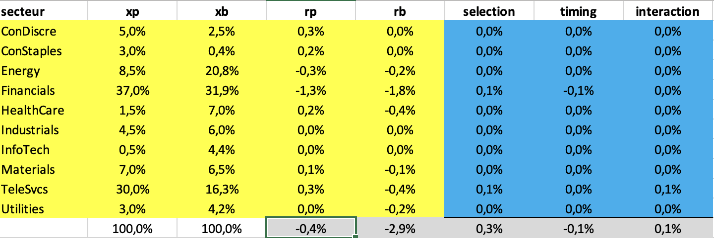

# Attribution-Performance-VBA
Analyse et décomposition de l'alpha (à la Brinson) d'un gérant de portefeuille

# Attribution de Performance

**Attribution de Performance** est un projet VBA permettant d'effectuer une analyse d'attribution de performance basée sur la méthodologie de Brinson. Le projet utilise des données financières pour analyser les performances sectorielles d’un portefeuille et son benchmark, tout en identifiant les contributions des facteurs tels que la sélection, le market timing et leur interaction.

---

## 📂 **Fichier de Données**

Le fichier Excel contient des données réelles issues du portefeuille d’un gérant (US) en 2010, avec des informations comme les rendements mensuels, les poids dans le portefeuille et le benchmark, et les secteurs associés. Ce projet inclut plusieurs procédures VBA pour effectuer les calculs nécessaires à l’analyse.

### **Structure des Données**
- **Identifiant de l'enregistrement** (colonne A) et du titre (colonne B).
- **Nom du titre**.
- **Rendement mensuel** : colonne D.
- **Poids dans le portefeuille** : colonne O.
- **Poids dans le benchmark** : colonne P.
- **Secteur** : colonne F.

---
## 🗂️ **Description du Projet**

## 🚀 **Fonctionnalités**

### 1. **Récupération et Configuration des Données**
Premier module de récupération des données sélectionnables puis de celles qui seront sélectionnées par l'utilisateur.
[📄 mod_recup_data.bas](mod_recup_data.bas)
Deux macros principales facilitent la préparation des données :
- **procRecupData** :
  - Récupère les champs de données et les dates disponibles.
  - L’utilisateur sélectionne ensuite les champs (secteur, dates, portefeuille, benchmark, rendement, identifiant) dans une colonne dédiée.
- **imp_data_attribution** :
  - Organise les données dans la feuille "calcul" :
    - Identifiant du titre.
    - Secteur.
    - Rendement.
    - Poids respectifs dans le portefeuille et le benchmark.

### 2. **Attribution de Performance avec la Méthodologie de Brinson**
Un autre module triant les donnnées par secteur afin de déterminer les différents alphas selon les différents benchmarks sectoriels.
[📄 mod_attribution_performances.bas](mod_attribution_performances.bas)
La procédure VBA **calc_brinson** permet de :
- Trier les données par secteur pour regrouper les titres similaires.
- Calculer pour chaque secteur :
  - **Poids sectoriels** dans le portefeuille et le benchmark.
  - **Rendement sectoriel** dans le portefeuille et le benchmark.
  - Contributions des facteurs :
    - **Sélection** : Impact de la sélection des titres.
    - **Market Timing** : Impact du changement des poids sectoriels.
    - **Interaction** : Effet combiné de la sélection et du market timing.
- Générer un tableau complet dans la feuille "attribution", résumant ces résultats.
- Vérifier que la relation suivante est respectée :  
  `Rendement total portefeuille = Benchmark + Sélection + Market Timing + Interaction`.

---

## 🛠️ **Méthodologie**

### **Étapes de Calcul :**
1. **Tri et Dénombrement :**
   - Tri croissant des secteurs pour regrouper les titres similaires.
   - Utilisation de `CountIf` pour dénombrer les titres d’un même secteur.
2. **Calcul des Poids Sectoriels :**
   - Application de `Sum` sur les colonnes de poids dans le portefeuille et le benchmark.
3. **Rendement Sectoriel :**
   - Utilisation de `SumProd` pour calculer les rendements sectoriels pondérés.
4. **Contributions des Facteurs :**
   - Sélection : `Poids benchmark × (Rendement portefeuille - Rendement benchmark)`.
   - Market Timing : `Rendement benchmark × (Poids portefeuille - Poids benchmark)`.
   - Interaction : `(Rendement portefeuille - Rendement benchmark) × (Poids portefeuille - Poids benchmark)`.
5. **Boucle et Résumé Final :**
   - Parcours des secteurs via une boucle Do Loop, calcul des résultats pour chaque secteur, et agrégation des rendements totaux.

### **Fonctions Excel Utilisées :**
- `WorksheetFunction.CountIf` : Dénombrer les titres d’un secteur.
- `WorksheetFunction.Sum` : Calcul des poids sectoriels.
- `WorksheetFunction.SumProduct` : Calcul des rendements pondérés.

---

## 📊 **Résultat Final**
Le tableau final (feuille "attribution") comprend :
1. Poids et rendements sectoriels (portefeuille et benchmark).
2. Contributions à la performance par facteur (sélection, market timing, interaction).
3. Résumé des rendements totaux et validation de l’équation :

---

## 📌 **Prérequis et Installation**

### **Prérequis :**
- Microsoft Excel (version prenant en charge les macros VBA).
- Activer les macros dans Excel (Options > Centre de gestion de la confidentialité > Paramètres des macros).

### **Installation :**
1. Télécharger ou cloner ce dépôt GitHub.
2. Ouvrir le fichier `Attribution_de_performance.xlsm`.
3. Suivre les étapes d’exécution des macros via l’interface utilisateur Excel.

---

## 🧑‍💻 **Utilisation**

1. Exécuter `procRecupData` pour récupérer les champs et les dates.
2. Configurer les champs nécessaires et la date souhaitée.
3. Exécuter `imp_data_attribution` pour organiser les données.
4. Lancer `calc_brinson` pour générer l’analyse d’attribution de performance.

---
